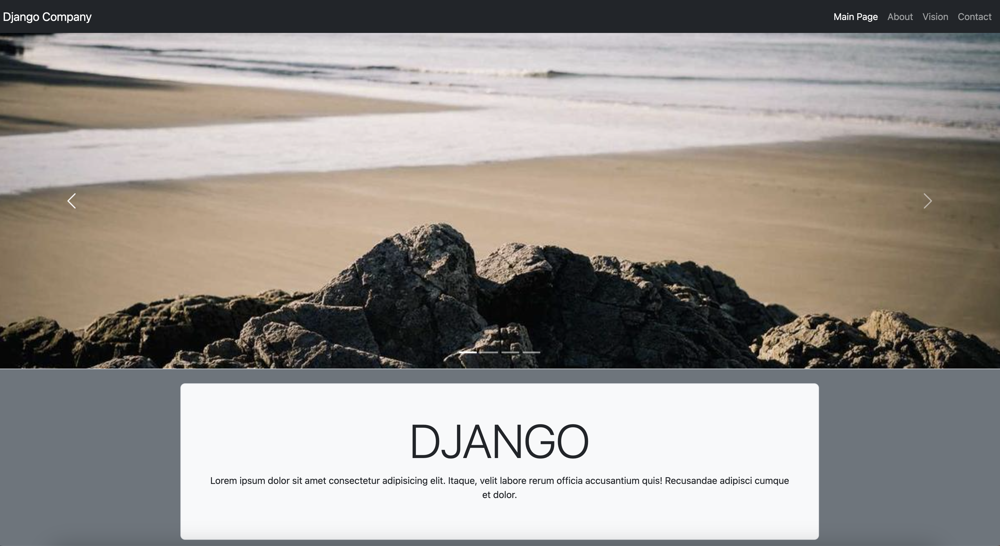
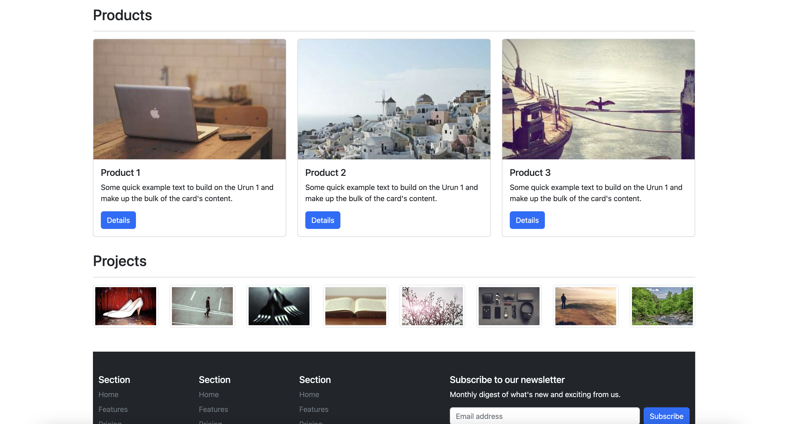
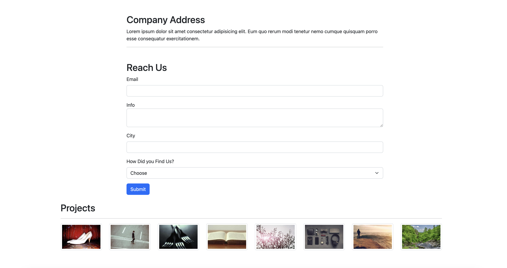

# Web Design Using Bootstrap
You can reach deployed site [here](https://bootstrap-project-level1.netlify.app/)

## Components Used
- Cards
- Navbar
- Forms
- Button
- Carousel

### Pictures Belongs to Site

